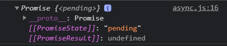
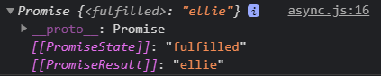

> async와 await은 프로미스보다 좀 더 간결하고, 동기적으로 실행되는 것처럼 보이게 만들어주는 녀석이다.

지난시간, 프로미스는 체이닝을 할 수 있다고 배웠다. 하지만 체이닝을 계속 하게 되면, 코드가 복잡해질 수 있다. 이를 극복하기 위해, 간편한 api인 async와 await을 사용하면 동기식으로 코드를 작성하는 것처럼 간단하게 작성할 수 있게 도와준다.

async와 await은 새롭게 추가된 것이 아닌, 기존의 promise위에서 조금더 간편한 api를 제공한다. 

이처럼 기존에 존재하는 것 위에, 혹은 기존에 존재하는 것을 감싸서 개발자가 간편하게 쓸 수 있도록 제공하는 것을 syntatic sugar라 한다.

자바스크립트에서 클래스 또한 syntatic sugar이다. 자바스크립트에서 클래스는 전혀 새로운 것이 아니라, prototype을 베이스로 한, 그 위에 살짝 덧붙여 그럴싸하게 보이는 syntatic sugar이다 🍭


## async 사용하기
시간이 오래 걸리는 함수나 작업의 경우, 비동기적으로 처리를 해주어야 한다. 그렇지 않으면 자바스크립트 엔진은 비동기적으로 코드를 수행하기 때문에 한 작업이 끝날 떄까지 다른 작업을 하지 못하고 마냥 기다리고만 있기 때문이다.

지난 시간에는 이를 promise로 해결했었다.

```javascript
function fetchUser(){
    
    return new Promise((resolve, reject)=>{
        // do network request in 10 secs...
        return 'ellie'
    })
}

const user = fetchUser();

console.log(user)
```
promise를 썼으면서 resolve와 reject를 호출하지 않고 그냥 리턴을 하게되면, promise가 현재 pending 상태라는 것을 콘솔에서 확인할 수 있다.


promise는 상태가 pending, fulfilled, reject 이렇게 세가지의 상태가 있는데, 위에서는 resolve도 호출하지 않았고 reject도 호출하지 않았기에 계속 pending 된 상태로 남아있게 된다.

그래서 promise안에서는 꼭 resolve나 reject로 완료시켜주어야 한다.

```javascript
function fetchUser(){
    
    return new Promise((resolve, reject)=>{
        // do network request in 10 secs...
        resolve('ellie')
    })
}
```

이제 promise가 fulfilled 로 바뀌게 되고, 결과도 'ellie'로 바뀌게 된 것을 확인할 수 있다.

이 코드를 간결하게 바꾸는 방법으로, async키워드를 사용한다.

```javascript
// 2. async
async function a_fetchUser(){
    return 'seoyeon'
}

const a_user = a_fetchUser();

console.log(a_user) // Promise{...}
a_user.then(console.log) // ellie
```
굳이 promise객체를 만들지 않아도, 함수 앞에 async 키워드를 써준 뒤 그냥 리턴만 해주면 자동으로 비동기처리가 된다.

async와 await이 promise를 감싸는 달달한 syntatic sugar라는 말이 생각나는가?

## await 사용하기
await이라는 키워드는 async가 붙은 함수 안에서만 사용가능하다.
```javascript
function delay(ms) {
  return new Promise((resolve) => setTimeout(resolve, ms));
}

async function getApple() {
  await delay(2000);
  return "🍎";
}

async function getBanana() {
  await delay(2000);
  return "🍌";
}

// // 콜백 지옥이 생각나게 하는 아래 코드.. promise 도코드가 난잡해진다
// function pickFruits(){

//     return getApple().then(apple =>{
//         return getBanana().then(banana => `${apple} +${banana}`)
//     })
// }

async function a_pickFruits() {
  const apple = await getApple();
  const banana = await getBanana();
  return `${apple} +${banana}`
}

a_pickFruits().then(console.log); // 약 4초 뒤 출력됨
```
## await 병렬처리
사과를 받아오는 데 await(2초 기다려) 되고, 바나나도 받아오는데 await(3초 기다려) 된다. 이렇게 순차적으로 진행되면 매우 비효율적이다.

바나나와 사과를 받아오는 데는 서로 연관이 1도 없기 때문에 기다릴 필요가 절대 없다.

await 이 병렬적으로 일을 처리할 수 있도록 각 프로미스들을 미리 만들어주자. 프로미스의 경우 생성과 동시에 실행되기 떄문이다.

```javascript
async function a_pickFruits() {
  const applePromise = getApple(
  const bananaPromise = getbanana()

  )
  const apple = await applePromise();
  const banana = await applePromise();
  return `${apple} +${banana}`
}

a_pickFruits().then(console.log); // 약 2초 뒤 출력됨

```
4초 -> 2초로 데이터를 가지고 오는 시간이 줄었다!
근데 보통 이런 코드는 더러워 잘쓰지 않고, 간단한 api를 사용해 위 기능을 쓴다.

## 4. Useful APIs
```javascript
function pickAllFruits(){
    return Promise.all([getApple(), getBanana()]).then(fruits =>
        fruits.join(' + ')
    );
}

pickAllFruits().then(console.log)
```

## 정리
async 와 await은 promise를 좀 더 간편하게 쓸 수 있는 녀석이다. promise에는 All이나 race같은 유용한 api들이 있다.
